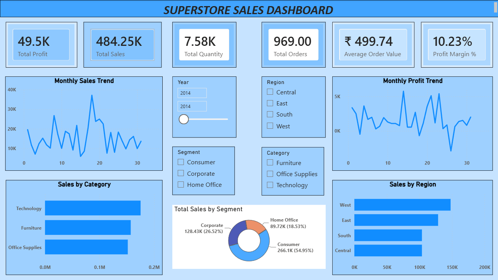

# Superstore Sales Analysis

## Project Overview

This is an end-to-end Data Analytics project built using **Excel, SQL, Python (Pandas), and Power BI**. 
The project analyzes Superstore sales data to uncover business insights related to sales performance, profitability, customer behavior, and product trends.

## 🛠️ Tools & Technologies

- Microsoft Excel
- MySQL
- Python (Pandas, Matplotlib)
- Power BI
- Git & GitHub

## Dataset

- Superstore Dataset
- 9994 Orders
- Sales, Profit, Quantity, Customer, Product and Shipping Information

## Project Workflow

1. Data Cleaning in Excel
2. SQL Business Analysis
3. Exploratory Data Analysis using Python
4. Interactive Dashboard Development in Power BI
5. Business Insights & Visualization

## Dashboard Pages

### Executive Dashboard

### Product Analysis

### Customer & Shipping Analysis

### Executive Dashboard
- KPI Cards
- Monthly Sales Trend
- Monthly Profit Trend
- Sales by Category
- Sales by Region

### Product Analysis
- Top 10 Products by Sales
- Bottom 10 Products by Profit
- Sales by Sub-Category
- Profit by Sub-Category
- Sales vs Profit Analysis

### Customer & Shipping Analysis
- Sales by State
- Sales by Customer Segment
- Orders by Ship Mode
- Average Order Value by Segment

## Key Business Insights

- Technology category generated the highest sales.
- West region contributed the highest revenue.
- Consumer segment accounted for the largest share of sales.
- Some products generated high sales but low profit.
- Shipping mode influenced order distribution and operational performance.

## Skills Demonstrated

- Data Cleaning
- Data Analysis
- SQL Queries
- DAX Measures
- Data Visualization
- Dashboard Design
- Business Intelligence
- Business Insights

##  Author

## Keshav Kashyap

Aspiring Data Analyst | Excel | SQL | Python | Power BI
